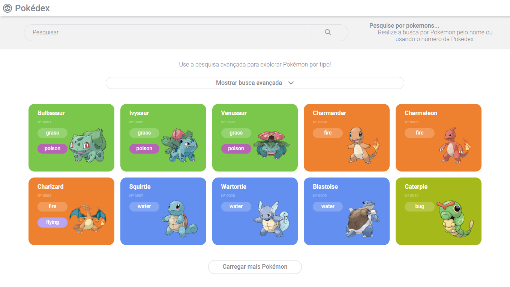
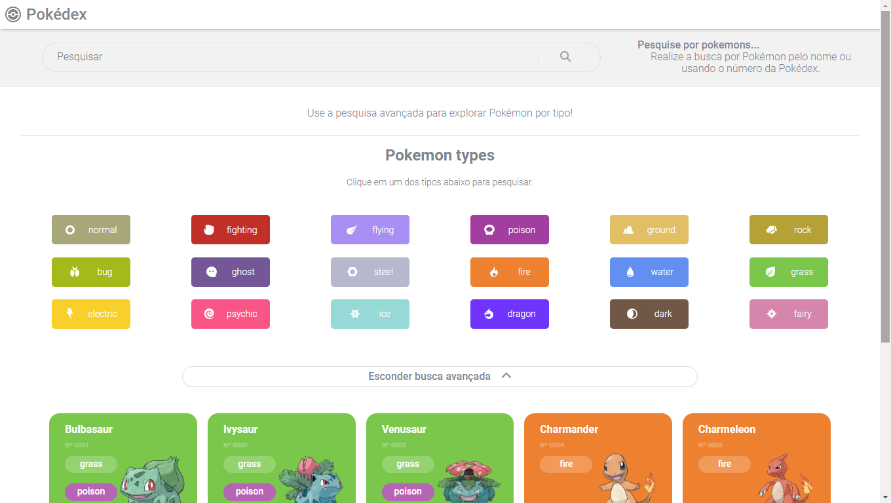
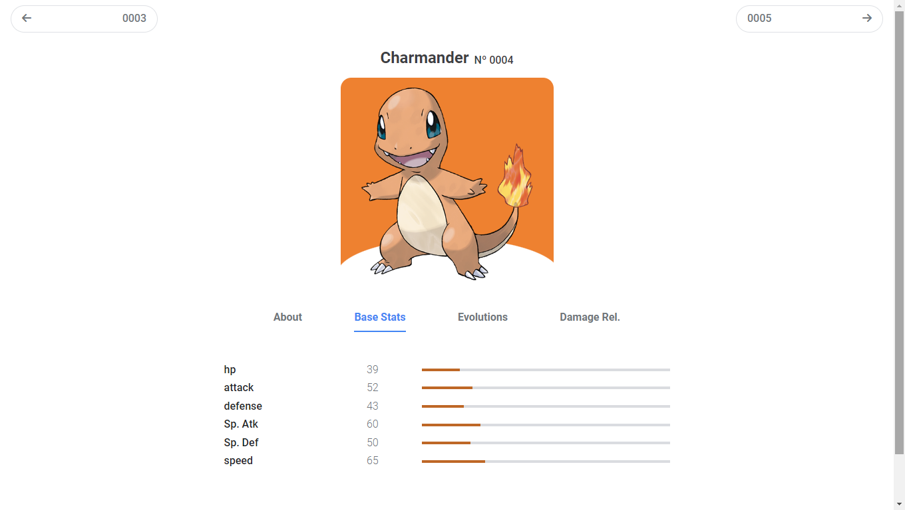

# Trilha JS Developer - Pokedex

## Potência Tech Angular Developer - Powered by iFood

O Potência Tech powered by iFood está de volta com um Bootcamp focado em Angular! Com cursos, desafios de projeto, desafios de código e mentorias exclusivas, o Bootcamp oferece uma experiência completa para quem quer começar uma carreira na área tech.

# Pokedex

Este projeto é uma Pokedex desenvolvida utilizando a API PokeApi e tecnologias como HTML, CSS, JavaScript, Node.js e Express. Foi desenvolvido durante o bootcamp Potência Tech Angular Developer - Powered by iFood da DIO.me.

A Pokedex permite que os usuários pesquisem por Pokémon pelo nome, número da Pokedex e tipo. Além disso, ela exibe informações detalhadas sobre cada Pokémon, como tipo, habilidades e estatísticas.

## Funcionalidades

- Pesquisa por nome: Permite que o usuário pesquise Pokémon pelo nome.
- Pesquisa por número da Pokedex: Permite que o usuário pesquise Pokémon pelo número da Pokedex.
- Pesquisa por tipo: Permite que o usuário pesquise Pokémon por tipo.
- Informações detalhadas: Exibe informações detalhadas sobre cada Pokémon, como tipo, habilidades e estatísticas.

## Responsividade

O site da Pokedex é responsivo e pode ser acessado em dispositivos móveis e desktops.

## Limitação de Pokémons

Este projeto exibe um limite máximo de 386 Pokémons, conforme definido pela PokeApi.

## Preview

Aqui estão algumas imagens e um GIF mostrando como é a Pokedex:

## Acesso ao site

O site da Pokedex pode ser acessado pelo link: https://js-developer-pokedex-mu.vercel.app/

## Como utilizar

Para utilizar a Pokedex, basta clonar o repositório e instalar as dependências com o comando `$ npm install`. Em seguida, inicie o servidor com o comando `$ npm start` e acesse o endereço `http://localhost:3000` em seu navegador.

## Tecnologias utilizadas

- HTML
- CSS
- JavaScript
- Node.js
- Express

## Atualizações futuras

- Adiciocar opção de trocar de tema da página entre claro e escuro
- Adicionar um tooltip em alguns botões
- Adicionar busca por fraquezas
- Atualizar busca avançada pra poder adicionar mais de um tipo

## Autor

Este projeto foi desenvolvido por **evertonpontes**.
